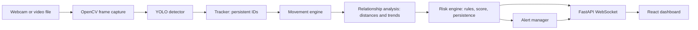
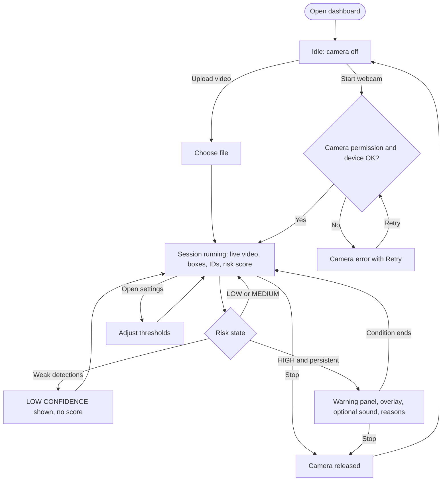
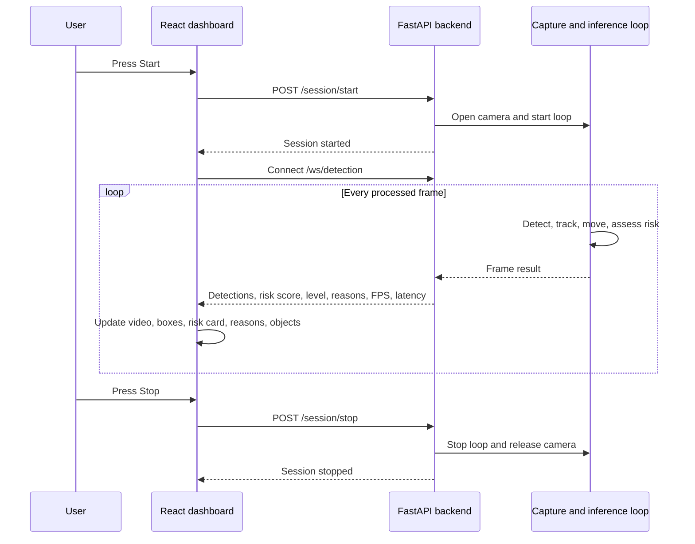
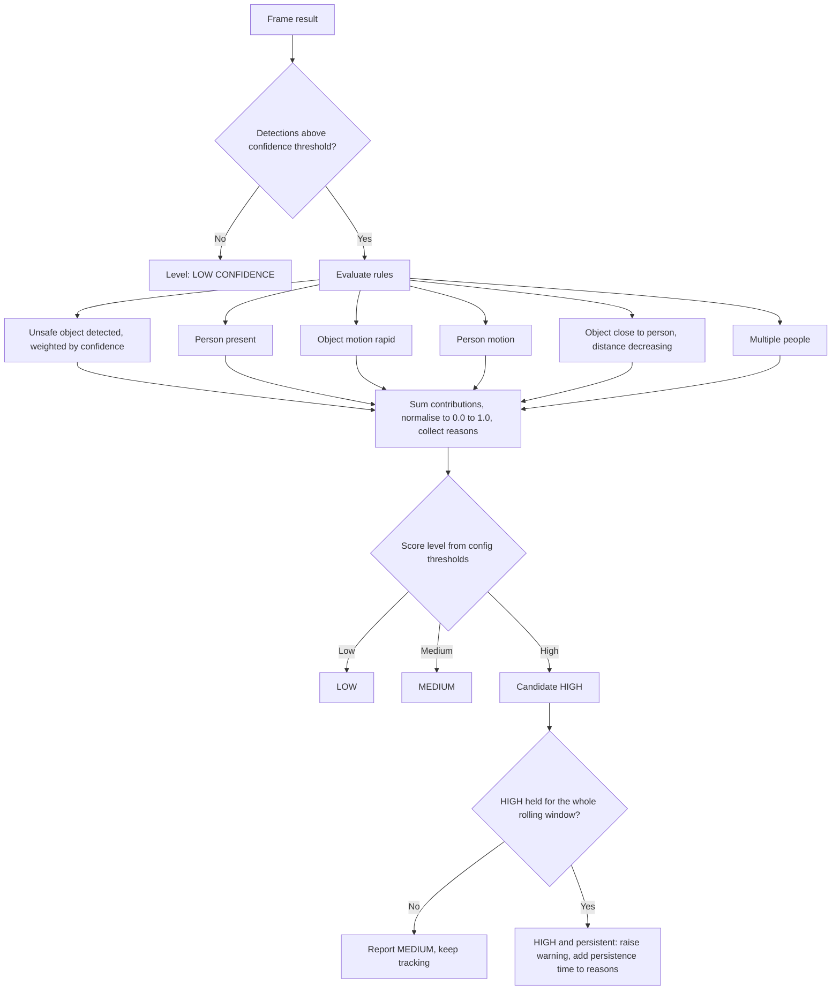
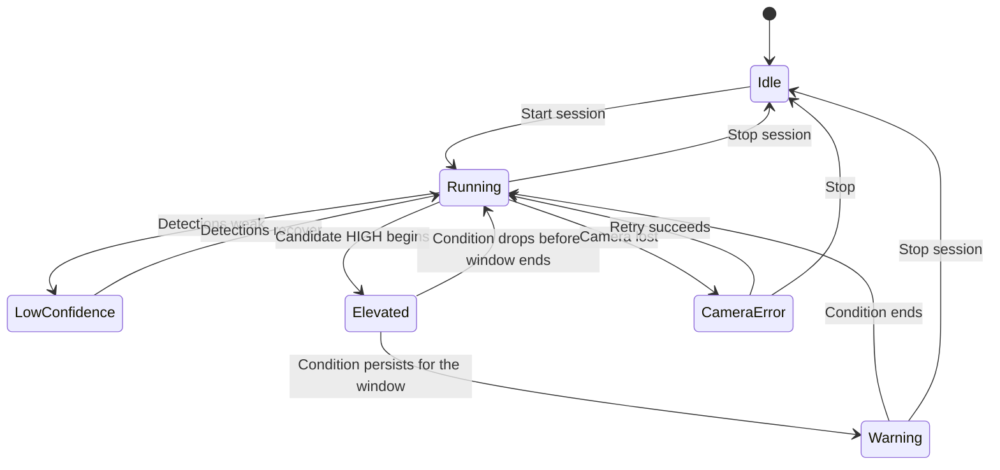
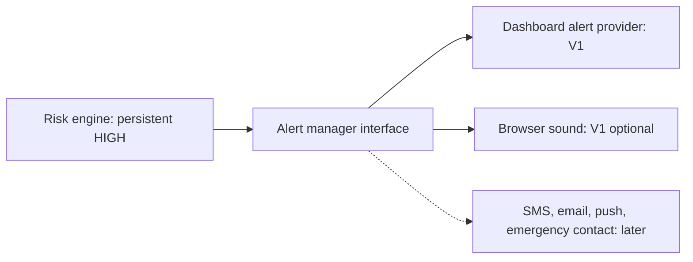

# Vision Guard V1: App Flow

Team: Peak Vision · IEEE Hackathon 2026 · PS 03.1 Version 1.0 · Status: Draft for build · Sources: PRD, Implementation Plan Companions: PRD, TRD, Implementation Plan, UI/UX Design Document

## 1. Purpose

This document describes how the application behaves from the user's first click to a warning, and how data moves through the system. It shows the user journey, the runtime pipeline, the session lifecycle, the risk decision logic and the failure paths. It does not repeat screen design (see the UI/UX document) or technology choices (see the TRD).

## 2. End-to-end pipeline

Every frame follows the same path. At every milestone camera → backend → frontend must keep working.

| Stage | Input | Output | Milestone |
| --- | --- | --- | --- |
| Capture | Camera or file | Timestamped frame | M1 |
| Detection | Frame | Class, confidence, bounding box (filtered by allow-list and confidence threshold) | M1 |
| Tracking | Detections | Object ID, class, box, centre, timestamp | M2 |
| Movement | Centre history | Speed, direction, displacement (smoothed) | M2 |
| Relationships | Tracked items | Person-to-object and person-to-person distance, distance trend | M3 |
| Risk engine | Signals and config | Score 0.0 to 1.0, level, reasons | M3 |
| Persistence and alerts | Rolling window of risk results | Warning on or off | M4 |
| Delivery | All of the above | One message per frame over the WebSocket, plus the video image | M1 onward |

## 3. User journey

## 4. Session lifecycle (frontend and backend)

Notes:

- The capture and inference loop runs in a background thread or task so it never blocks the API.
- `GET /health` is used to confirm the backend is up. `GET /config` returns the values shown in settings.
- If the frontend loses the WebSocket it reconnects automatically and shows Disconnected until it does.

## 5. Risk decision flow

The risk engine runs once per processed frame, but a warning needs a condition to persist.

Guarantees:

1. A single frame can never produce HIGH (FR-16).
2. Weak detections report LOW CONFIDENCE, never HIGH (FR-17).
3. Every result carries at least one human-readable reason (FR-15).
4. All weights and thresholds come from one configuration location (FR-14).

## 6. Warning state machine

## 7. Scenario walk-throughs

**Scenario 1: Harmless prop sits still (UC4)** Prop and person are detected, nothing moves, the prop is far from people. Score stays LOW or MEDIUM, no warning, reasons explain why.

**Scenario 2: Rapid approach (UC3, demo script)**

1. A person enters and is detected as Person #1.
2. A knife-like prop is detected as Knife #1.
3. The prop begins moving rapidly and the distance to Person #2 shrinks.
4. The condition holds for the persistence window.
5. The dashboard shows POTENTIAL SAFETY RISK at 84%, with reasons: unsafe object detected, rapid movement, proximity decreasing, persistent condition.
6. When the prop is removed or stops, the warning clears automatically.

**Scenario 3: Low light or occlusion** Confidence drops below the threshold. The dashboard shows LOW CONFIDENCE with causes and does not raise a warning.

**Scenario 4: Threshold change (UC5)** The operator raises the persistence window in Settings. The change is sent to the configuration endpoint and the next evaluation uses it.

**Scenario 5: Uploaded video (UC2, P1)** The user uploads a file, which is processed as a session through the same pipeline. Processing speed (real-time playback or faster) is an open item.

## 8. Error and recovery flows

| Event | System behaviour | User sees |
| --- | --- | --- |
| Camera unavailable or permission denied | Session does not start, error returned | "Camera unavailable" with Retry |
| Camera disconnects mid-session | Loop stops cleanly, camera released | Camera error state |
| A single frame fails to process | Frame skipped, loop continues | Nothing, or a brief dip in FPS |
| Inference too slow | Frames are skipped rather than freezing | Lower FPS in the header |
| WebSocket drops | Frontend retries connection | Disconnected, then Connected |
| Backend unreachable | Start fails | Disconnected pill, retry option |
| Stop pressed | Loop ends, camera released | Return to Idle |

## 9. Alert flow and future extension

The risk engine only talks to the alert manager. New providers can be added later without changing risk logic.

## 10. API and message touchpoints

| Interaction | Endpoint | Trigger |
| --- | --- | --- |
| Check backend | `GET /health` | App load |
| Start session | `POST /session/start` | Start button |
| Stop session | `POST /session/stop` | Stop button |
| Read or update configuration | `GET /config` and the configuration endpoint | Settings dialog |
| Real-time results | WebSocket `/ws/detection` | Session running |

Each WebSocket message carries objects (id, class, confidence, box, optional speed and direction), risk score, level and reasons, a persistent-warning flag, and FPS and latency. The final schema is in TRD section 7.2. Schema changes stay backward compatible between milestones.

## 11. Flow by milestone

| Milestone | Flow available |
| --- | --- |
| M1 | Start, capture, detect, stream, display boxes, Stop |
| M2 | Adds tracking IDs and movement values to the stream and UI |
| M3 | Adds relationship analysis, risk score, level and reasons |
| M4 | Adds persistence window, warning panel, sound, settings, recovery paths, optional upload |

## 12. Privacy and safety in the flow

- Video is processed locally and not stored by default.
- No face recognition, identity data or emotion inference appears anywhere in the flow.
- Warnings use neutral wording and a human is expected to verify.
- Demos use harmless props or recorded clips, never real weapons.

## 13. Open items

- Video delivery method to the browser (annotated frames from the backend is recommended).
- Numeric thresholds and persistence duration.
- Uploaded video: real-time playback or faster-than-real-time.
- Whether audio and upload are in the first demo.